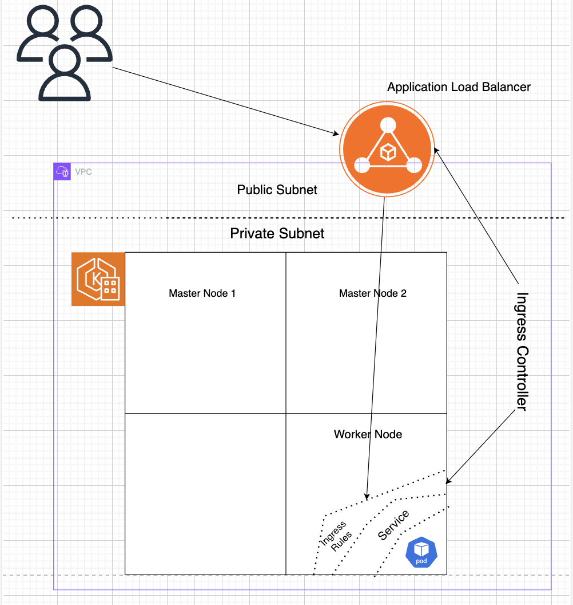

# eksProject


# Steps 
1. Install aws cli, eksctl, kubectl, helm.

2. Create the EKS Cluster
```
eksctl create cluster --name demo-cluster --region us-east-1 --fargate
```

3. Update the kubeconfig file for your Amazon Elastic Kubernetes Service (EKS) cluster.
```
aws eks update-kubeconfig --name your-cluster-name
```

4. Create a new fargate profile
```
eksctl create fargateprofile \
    --cluster demo-cluster \
    --region us-east-1 \
    --name alb-sample-app \
    --namespace <namespace>
```

5. Apply the Yaml file to creare deployment, Service, Ingress
```
kubectl apply -f https://raw.githubusercontent.com/kubernetes-sigs/aws-load-balancer-controller/v2.5.4/docs/examples/2048/2048_full.yaml
```

6. Check if the resources are created
```
kubectl get pods -n namespace
kubectl get svc -n namespace
kubectl get ingress -n namespace
```

7. Configure IAM OIDC as we need to create ALB Contoller(Kubernete Pod) which needs to talk to the AWS Resource ALB
```
eksctl utils associate-iam-oidc-provider --cluster $cluster_name --approve
```

8. Download IAM Policy
```
curl -O https://raw.githubusercontent.com/kubernetes-sigs/aws-load-balancer-controller/v2.5.4/docs/install/iam_policy.json
```

9. Create IAM Policy 
```
aws iam create-policy \
    --policy-name AWSLoadBalancerControllerIAMPolicy \
    --policy-document file://iam_policy.json
```

10. Create IAM Role
```
eksctl create iamserviceaccount \
  --cluster=<your-cluster-name> \
  --namespace=kube-system \
  --name=aws-load-balancer-controller \
  --role-name AmazonEKSLoadBalancerControllerRole \
  --attach-policy-arn=arn:aws:iam::<your-aws-account-id>:policy/AWSLoadBalancerControllerIAMPolicy \
  --approve
```

11. Deploy ALB Controller
```
helm repo add eks https://aws.github.io/eks-charts

helm repo update eks

helm install aws-load-balancer-controller eks/aws-load-balancer-controller \            
  -n kube-system \
  --set clusterName=<your-cluster-name> \
  --set serviceAccount.create=false \
  --set serviceAccount.name=aws-load-balancer-controller \
  --set region=<region> \
  --set vpcId=<your-vpc-id>

kubectl get deployment -n kube-system aws-load-balancer-controller
```

12. In AWS Console check the load balancer section, it should be up and running

13. Check
```
kubectl get ingress -n namespace
```

## Theory
- In kubernetes mainly there are two components - Control plane / Master & Data plane / Worker.
- For example, if we want to create 3 master node and 3 worker node kubernetes cluster, we will create 6 EC2 instance on AWS 
and install configuration in master nodes like API Server, etcd, Scheduler, Controller etc, user typically access application on worker node via master node. Similarly you do configuration in worker node and join them. This is a very tedious process and error prone. 
- Now we can use Kops to create all this configuration. But there can be problems like certification exxpired, API Server is slow etc. This will make the work too hectic. 
- All this manual activity can be replaced with managed servce like EKS.
- EKS is a managed control plane. But it also help wrt worker node. 
- There are two ways in which you can create these worker nodes - EC2 and other is Fargate. 
- Fargate is AWS Serverless compute. It is differnet from lambda functions as lambda is defined for small amount of workload (quick functions / actions). 